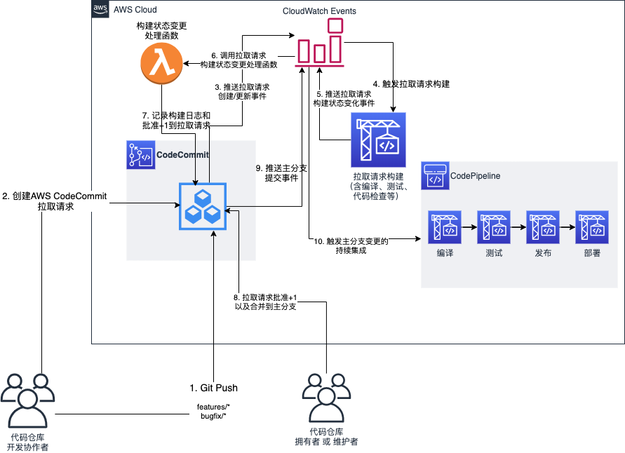

# 基于 AWS CodeCommit 的 Devops 最佳实践

[English version](README.md)

> 本文介绍的最佳实践可应用到AWS全球区和[AWS中国区域][codecommit-china-ga-news]。详细的实践步骤请参考[博客][cn-blog]。

AWS CodeCommit是一个**托管的**、**安全的**、**Git**源代码管理服务。AWS CodeCommit主要针对企业内部代码协作，所以他并没有像[Github][github]或者[Gitlab][gitlab]一样实现一些社交相关的功能，比如fork和喜欢等。[Gerrit Code Review][gerrit]是一款成熟且被Andorid和Eclipse基金会项目广泛使用的代码协作工具，AWS CodeCommit也很容易借鉴Gerrit的思路用于各种开发团队的协作。

这里推荐的最佳实践由以下特性和工作流程组成，

- 每个代码仓库用户包含两种角色，
  - 代码仓库`所有者`或`维护者`
  - 代码仓库`开发参与者`
- `开发参与者`有权限读取仓库，从仓库拉取代码更新，但仅可以将代码推送到特定前缀开头的分支，例如`pr/`, `features/`和`bugs/`。`参与者`能够创建、关闭和评论`代码合并请求`。
- 代码仓库`所有者`或`维护者`除了拥有`参与者`权限外，还具备一些仓库管理权限。例如，更新仓库信息，同意以及执行合并`代码合并请求`。
- 任何人都不可以直接推送代码到仓库**主分支**，包括仓库`所有者`或`维护者`。
- 每一个新创建的`代码合并请求`以及`代码合并请求`源分支的代码变动将自动触发AWS CodeBuild服务为该仓库集成的`PR构建`。该构建会将状态已评论的形式更新回对应的`代码合并请求`。如果构建成功，会为对应的`代码合并请求`的`同意合并`投票加一。
- 默认的最佳合并请求规则会被创建且关联到对应仓库上。该合并规则要求`代码合并请求`至少需要收到两票`同意合并`投票才可被合并。
- AWS CodeBuild构建/AWS CodePipeline流水线会被创建，同仓库的主分支所关联。每当主分支有的代码更变，将自动触发该仓库的部署，同整体业务系统的集成。

完整的工作流程图如下，



这个最佳实践通过[AWS CDK][cdk]/[CloudFormation][cloudformation]贯穿了基础架构即代码的理念，即使企业有成百数千的代码仓库也可以按最佳实践的方式统一管理。

## 如何部署 demo 应用

### 准备条件

- 安装 Node LTS 版本(例如 12.x)
- 为 [awscli](https://docs.aws.amazon.com/polly/latest/dg/setup-aws-cli.html) 配置你的 AWS 账户
  
### 部署步骤
```shell
# 安装项目部署依赖及 Lambda 函数依赖。为首次使用 AWS CDK，初始化 cdk toolkit。
npm run init

# 部署
npm run deploy
```

### 清理环境
```shell
npm run cleanup
```

## License

This sample code is made available under the MIT-0 license. See the LICENSE file.

[codecommit]: https://aws.amazon.com/codecommit/
[github]: https://github.com/
[gitlab]: https://about.gitlab.com/
[gerrit]: https://www.gerritcodereview.com/
[cdk]: https://aws.amazon.com/cdk/
[cloudformation]: https://aws.amazon.com/cloudformation/
[codecommit-china-ga-news]: https://www.amazonaws.cn/new/2020/aws-codecommit-available-aws-china-beijing-sinnet-ningxia-nwcd/?nc1=h_ls
[cn-blog]: https://aws.amazon.com/cn/blogs/china/scalable-agile-development-practices-based-on-aws-codecommit/